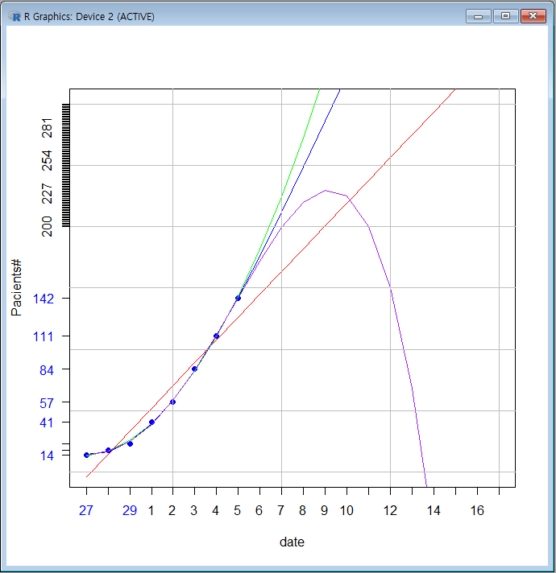

# corona19usa

|날자|인원|
|---|---|
|2월27일 | 14|
|2월28일 | 18|
|2월29일 | 23|
|3월1일 | 41|
|3월2일 | 57|
|3월3일 | 84|

# 선형예측  
    xmax=20
    ymax=300
    y<-c(14,18,23,41,57,84)
    x<-c(1:6)
    lm(x~y)
    #fit first degree polynomial equation:
    fit1<-lm(y ~ x)
#    fit1
#    fit1$coefficients[[1]]
#    fit1$coefficients[[2]]
#    fit1$residuals #잔차
    summary(fit1)
    title("Regresson of Day~Patients")
    plot(x, y,pch=19, xlim=c(1,xmax), ylim=c(0,ymax), xlab = "date", ylab = "Pacients#", col="blue", yaxt='n', xaxt='n') #25~29, 1~3일 예측해 보기
    #first degree
#    abline(fit, col='red')
    #second degree
    fit2 <- lm(y~poly(x,2,raw=TRUE))
    #third degree
    fit3 <- lm(y~poly(x,3,raw=TRUE))
    #fourth degree
    fit4 <- lm(y~poly(x,4,raw=TRUE))
    #generate range of 31 numbers starting from 19 and ending at 50
    xx <- seq(1, xmax, length=xmax)
    lines(xx, predict(fit1, data.frame(x=xx)), col="red")
    lines(xx, predict(fit2, data.frame(x=xx)), col="green")
    lines(xx, predict(fit3, data.frame(x=xx)), col="blue")
    lines(xx, predict(fit4, data.frame(x=xx)), col="purple")

    grid(lty=1, lwd=1, col='gray')

    axis(side=1, at=c(1:3), labels=c(27:29),col.axis="blue") #, lwd=2.5)
    axis(side=1, at=c(4:xmax), labels=c(1:(xmax-3)))#,col="red") #, lwd=2.5)

    axis(side=2, at=y, labels=y, col.axis="blue", las=2)
    axis(side=2, at=c(100:ymax), labels=c(100:ymax))#, col="red", col.axis="green)

